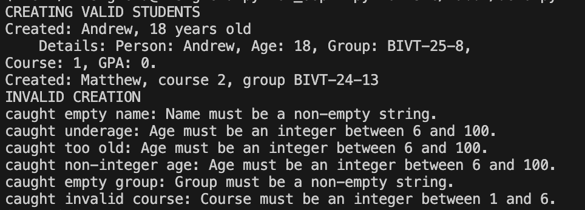
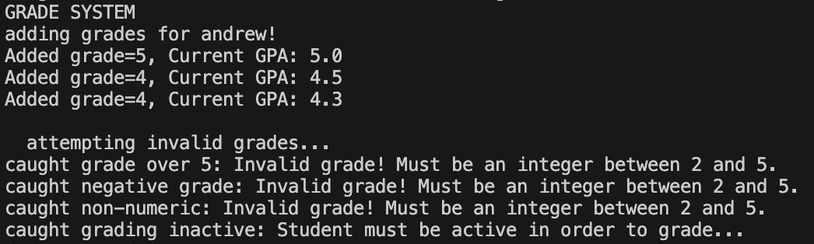
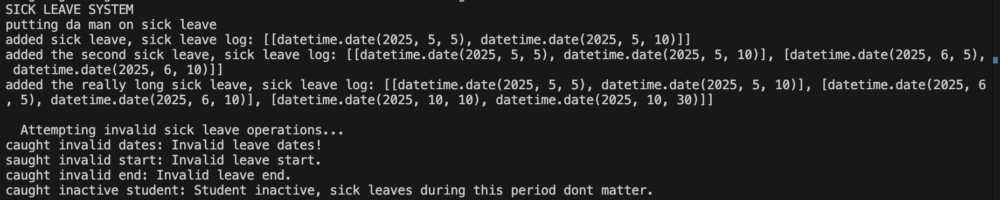
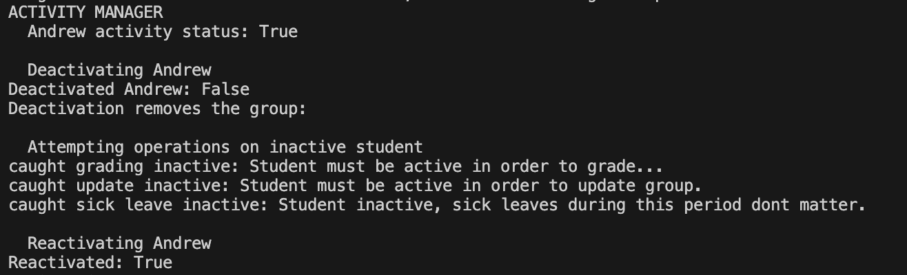
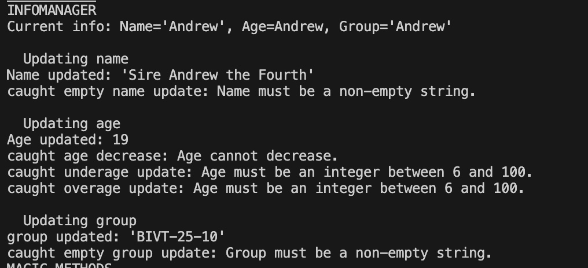
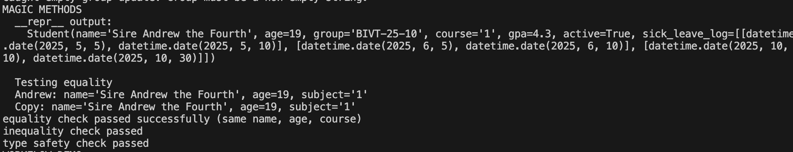
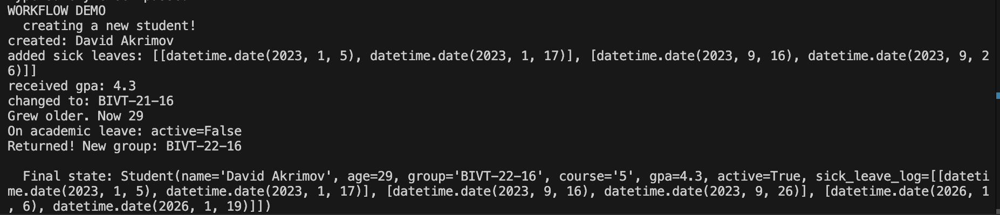

# Лабораторная работа №1: Class Student


## Цель работы

- Освоить объявление пользовательских классов
- Разобраться с инкапсуляцией (закрытые поля)
- Реализовать свойства (`@property`)
- Переопределить магические методы (`__str__`, `__repr__`, `__eq__`)
- Понять разницу между атрибутами класса и экземпляра

**План**
Создать класс Student, который

~ Сам следит за корректностью данных (валидация)

~ Запрещает недопустимые операции (работы с Active state)

~ Предоставляет удобный интерфейс через свойства (@property)

## Реализованный класс

**Student**

Student - Главный класс, моделирующий студент. Содержит всю логику работы.

**Атрибуты класса:**
- `course` — Курс.
- `personal_info` — Имя, возраст, группа. Одним списком.
- `gpa` — Grade-Point-Average, или средний балл.
- `active` — State, отвечающий за доступность студента.
- `sick_leave_log` — Список, содержащий начало-конец всех больничных студента.

**Закрытые поля:**
- `_grades` - Оценки студента.
  
**Свойства @property:**
- Чтение: `student_name` - имя
- Чтение: `student_age` - возраст
- Чтение: `student_group` - группа
- Чтение и запись: `student_sick_leave_log` - больничные
- Чтение и запись: `student_gpa` - средний балл

**Магические методы:**
- `__str__` — для print (читаемое описание)
- `__repr__` — для разработчиков
- `__eq__` — сравнение по имени, возрасту и курсу.

**Бизнес-методы:**
- `grade(int)` - Выставить оценку. 
- `add_sick_leave(date, date)` - Добавить больничный.

**Сценарий 1: Создание студентов**



- Создание студента с параметрами по умолчанию

- Создание второго студента с другим курсом и группой

- Ошибки при создании студентов

**Сценарий 2: Система оценок**



- Добавление оценок с автоматическим подсчетом GPA

- Ошибки при выставке оценок

**Сценарий 3: Бизнес метод с системой больничных**



- Добавить больничный

- Прочитать ВСЕ больничные

- Разные ошибки

**Сценарий 4: Менеджер активности**



- Активировать/деактивировать студента.

- Разная логика работы с неактивным студентом.


**Сценарий 5: Менеджер информации**



- Изменение имени, возраста, группы 

- Ошибки с изменением вышеупомянутых полей

**Сценарий 6: Волшебные методы**



- Вывод ```repr```, метод для разработчиков

- Вывод ```eq```, проверка равенства.

**Сценарий 7: Демо работы**



- Создание студента

- Больничный, оценки, группы и возраст

- Академический отпуск, возвращение

# Вопросы

## Что является сущностью?

- Обьект, или экземпляр класса. Класс является абстракцией, структурой - а обьект является физическим воплощением. В гипотетической области университета существует гипотетический обьект: студент, которого мы описываем классом Student.

## Какие у него атрибуты?

- ```course```, ```personal_info```, ```gpa```, ```active```, ```sick_leave_log``` и ```_grades``` - ХАРАКТЕРИСТИКИ объекта. Они описывают его.

- ```grade``` является действием. Оно меняет характеристику объекта.

## Какие инварианты?

- ```name```, ```group``` не пустые. ```age```, ```course``` находятся в резонных пределах, например ```6 < age < 100```.

## Что значит “равенство”?

- Два студента будут равны, когда их имя, возраст и курс совпадают. 

## Есть ли состояние?

- Да! Студент может быть активным, когда учится и сдает экзамены, получает оценки и тд. Если студент неактивен, он в академическом отпуске - не может получать оценки, отправлять больничные и тд.
