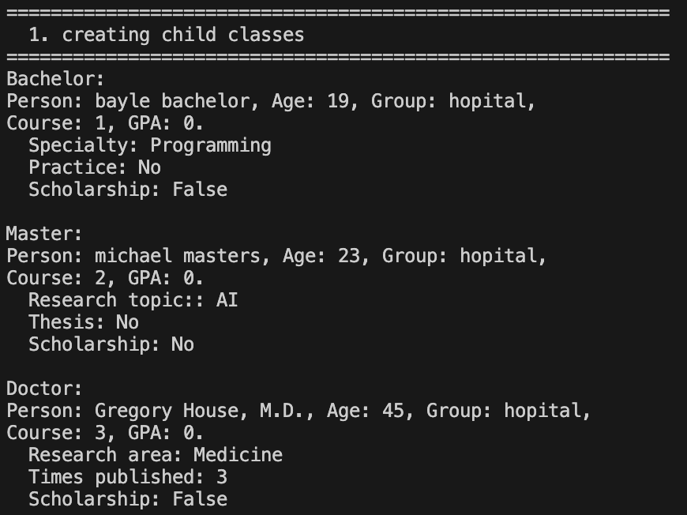
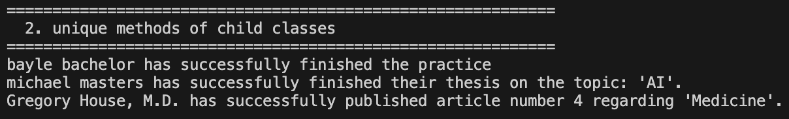
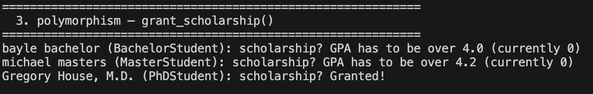
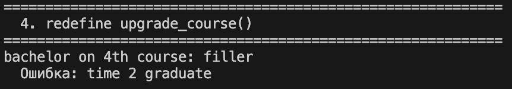
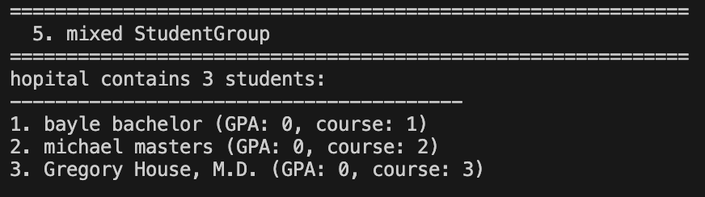
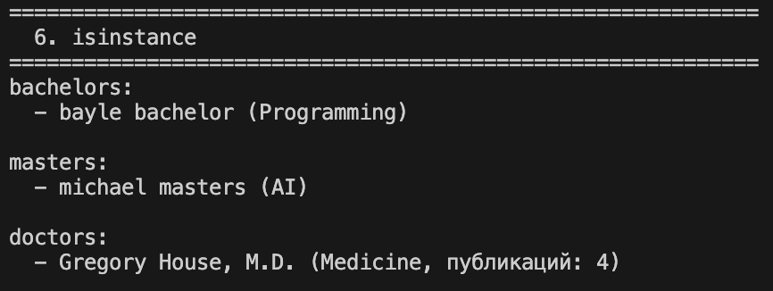
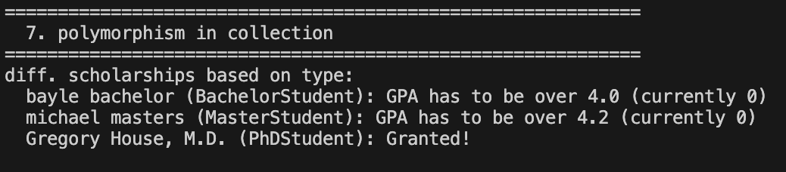
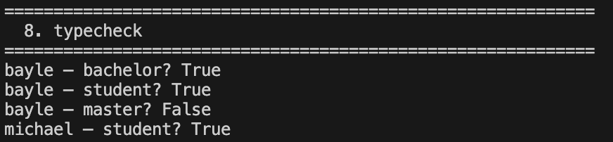
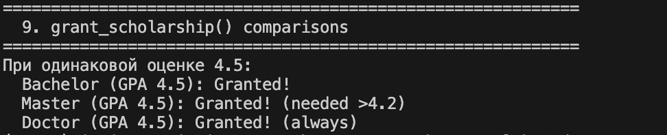

# ЛР-3 — Наследование и иерархия классов


## Цель работы

Освоить механизм наследования классов, научиться строить иерархию объектов, понять разницу между базовым и производным классом, освоить переопределение методов и полиморфизм.

---

## Реализованная иерархия

```text
Student
 - BachelorStudent  — бакалавр
 - MasterStudent    — магистр
 - PhDStudent       — аспирант
```

BachelorStudent — добавляет специализацию `specialty` и флаг прохождения практики `has_practice`. Переопределяет `upgrade_course()` — бакалавр учится только до 4 курса.

MasterStudent — добавляет тему исследования `research_topic` и флаг защиты диссертации `has_thesis`. Переопределяет `grant_scholarship()` — магистры получают стипендию только при оценке выше 4.2 (более строгое требование).

PhDStudent — добавляет область исследований `research_area` и количество публикаций `publications`. Переопределяет grant_scholarship() — аспиранты получают стипендию всегда (если активны).

Каждый дочерний класс переопределяет `__str__()` — выводит базовую информацию плюс свои уникальные поля.

## Демонстрация работы

Сценарий 1 — создание объектов разных типов (бакалавр, магистр, аспирант) и вывод их через `print()`.


Сценарий 2 — вызов уникальных методов каждого типа: `complete_practice()`, `defend_thesis()`, `publish_article()`.


Сценарий 3 — полиморфизм без условий: один вызов `grant_scholarship()` для всех объектов, каждый отвечает по своему (бакалавр — оценка > 4.0, магистр — оценка > 4.2, аспирант — всегда True).


Сценарий 4 — переопределение `upgrade_course()`: бакалавр на 4 курсе не может перевестись дальше.


Сценарий 5 — интеграция с коллекцией `StudentGroup` из ЛР-2: коллекция хранит объекты разных типов.


Сценарий 6 — фильтрация коллекции по типу через `isinstance()`: вывод отдельно бакалавров, магистров и аспирантов.


Сценарий 7 — полиморфизм в коллекции: вызов `grant_scholarship()` для всех студентов, каждый тип ведёт себя по-своему.


Сценарий 8 — проверка типов через `isinstance()`: демонстрация, что дочерние объекты являются экземплярами базового класса.


Сценарий 9 — сравнение поведения `grant_scholarship()` при одинаковой оценке 4.5 для разных типов.


## Вывод
В ходе лабораторной работы было изучено наследование классов в Python — как дочерний класс расширяет базовый через super() не дублируя код. Освоен полиморфизм — один метод grant_scholarship() работает по-разному в зависимости от типа объекта. Реализована интеграция с коллекцией из ЛР-2 — коллекция StudentGroup хранит объекты разных типов (бакалавров, магистров, аспирантов) и корректно работает с ними. Выполнена фильтрация по типу через isinstance(). Создан файл base.py для централизованного импорта базового класса из ЛР-1.

В ходе ЛР я изучил наследование классов в Python, как дочерний класс расширяет базовый не дублируя код. Освоил полиморфизм через grant_scholarship() - метод работает по разному в зависимости от типа обьекта. Была реализована интеграция с StudentGroup из ЛР-2 и проверена ее работа с разными типами. Была выполнена фильтрация по типу ичерез isinstance(). 