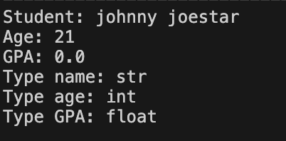
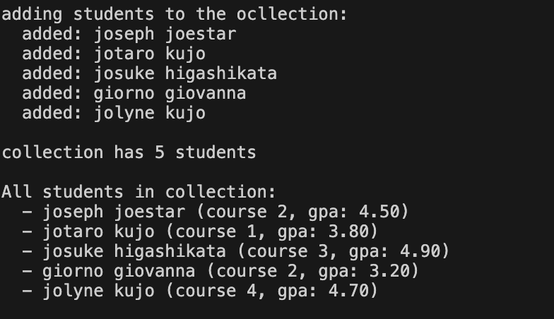
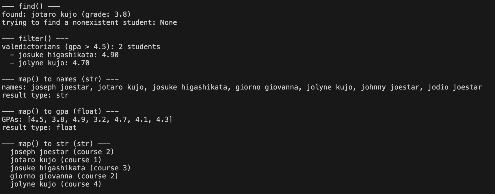
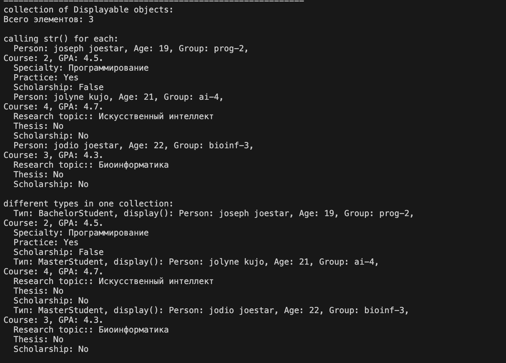
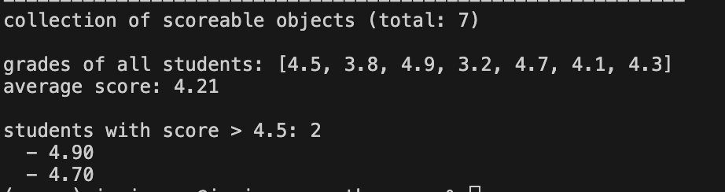

# Лабораторная работа №6 — Generics и typing

## 1. Цель работы

Освоить систему аннотаций типов в Python (`typing`), научиться создавать обобщённые (generic) классы с помощью `TypeVar` и `Generic`, понять концепцию структурной типизации через `typing.Protocol`.

---

## 2. Реализованные типы и контейнеры

### Generic-коллекция `TypedCollection` (оценка 3 и 4)

| TypeVar | Описание |
|---------|----------|
| `T` | Тип элементов коллекции |
| `R` | Тип результата после `map()` |

| Метод | Аннотация |
|-------|-----------|
| `add` | `def add(self, item: T) -> None` |
| `remove` | `def remove(self, item: T) -> bool` |
| `get_all` | `def get_all(self) -> list[T]` |
| `find` | `def find(self, predicate: Callable[[T], bool]) -> Optional[T]` |
| `filter` | `def filter(self, predicate: Callable[[T], bool]) -> list[T]` |
| `map` | `def map(self, transform: Callable[[T], R]) -> list[R]` |

### Протоколы (оценка 5)

У протокола `Displayable` должен быть метод `__str__ -> str` к которому подходят `Student`, `BachelorStudent`, `MasterStudent`, `PhDStudent` 
У протокола `Scorable` должен быть метод `score() -> float` к которому подходят `Student`, `BachelorStudent`, `MasterStudent`, `PhDStudent` 

Классы не наследуют эти протоколы. Они подходят автоматически, потому что у них есть методы `__str__()` и `score()`.

---

## 3. Демонстрация работы

### Сценарий 1: Аннотации типов (на 3)

**Что демонстрирует:** Аннотации типов в классах.

---

### Сценарий 2: Generic-коллекция (на 3)

**Что демонстрирует:** Работу `TypedCollection[Student]`.

---

### Сценарий 3: find, filter, map (на 4)

**Что демонстрирует:**
- `find()` — поиск студента по имени
- `filter()` — отбор отличников
- `map()` — преобразование студентов в имена (`str`) и в оценки (`float`)

---

### Сценарий 4: Протокол Displayable (на 5)

**Что демонстрирует:** Коллекция принимает любые объекты с методом `display()`.

---

### Сценарий 5: Протокол Scorable (на 5)

**Что демонстрирует:** Коллекция принимает любые объекты с методом `score()`.

