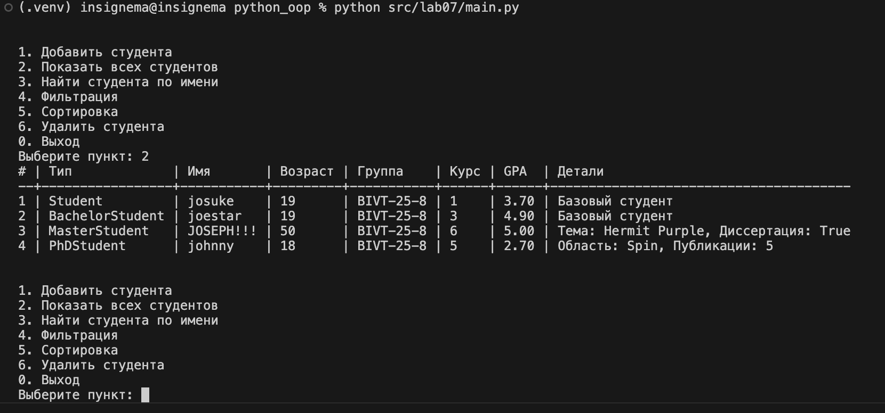
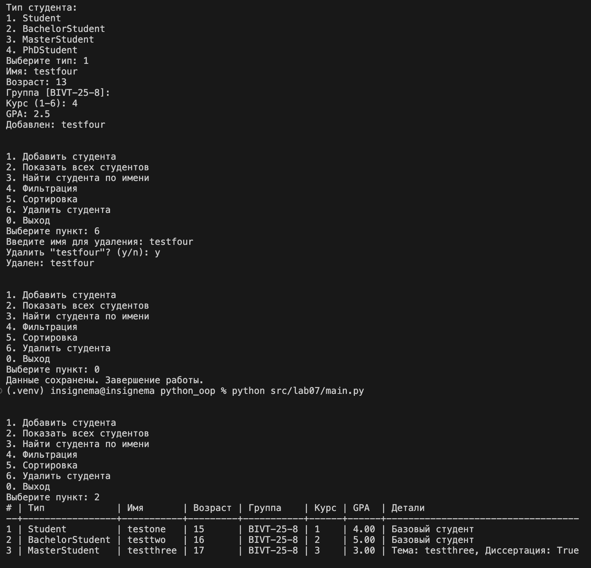
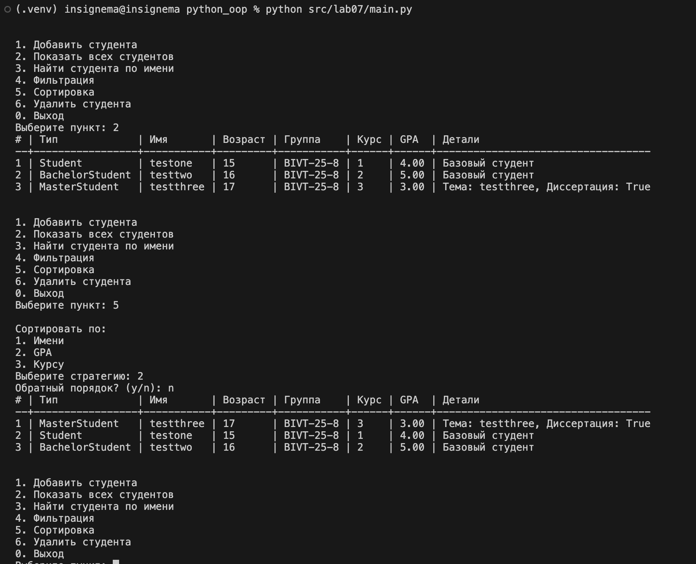
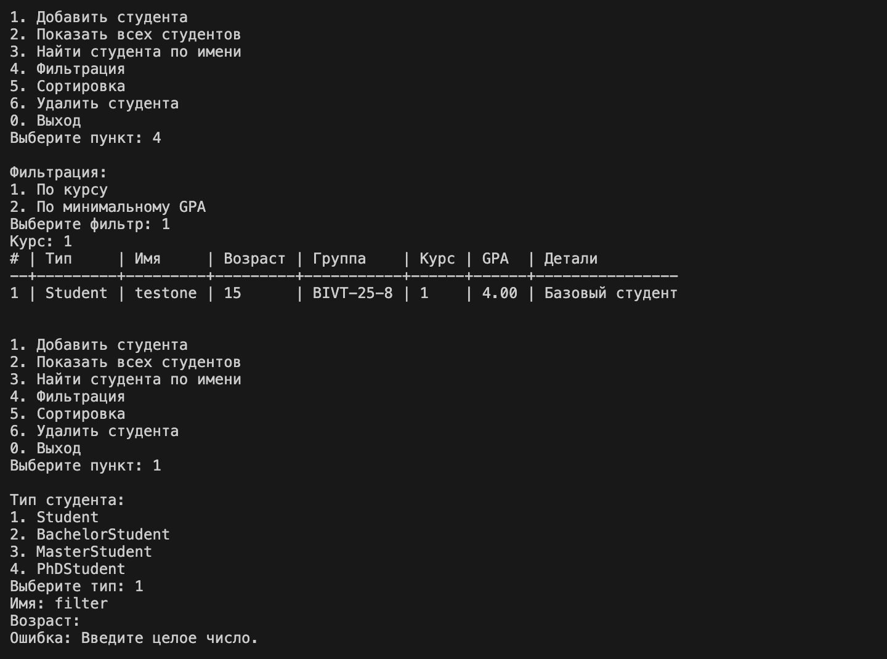

# Лабораторная работа №7 — Консольное приложение

## 1. Цель работы
Цель лабораторной работы — объединить результаты ЛР1–ЛР6 в единое консольное приложение для управления коллекцией студентов.

В работе реализованы:
- многоуровневая архитектура (CLI, бизнес-логика, хранение данных);
- интерактивный интерфейс с меню и обработкой ошибок ввода;
- поиск, фильтрация и сортировка коллекции;
- собственные исключения предметной области;
- автозагрузка и автосохранение данных в JSON;
- аннотации типов и docstring для публичных методов.

## 2. Предметная область
Приложение использует предметную область из предыдущих лабораторных без изменения базовой модели:
- `Student` — базовый тип студента;
- `BachelorStudent` — студент бакалавриата (специальность, статус практики);
- `MasterStudent` — студент магистратуры (тема исследования, статус защиты);
- `PhDStudent` — аспирант (научная область, число публикаций).

Коллекция реализована через `StudentGroup` из ЛР2/ЛР5.

## 3. Архитектура решения
Решение построено по 3-слойной схеме:

1. `cli.py` — слой интерфейса.
Отвечает только за:
- вывод меню;
- чтение и валидацию пользовательского ввода;
- форматированный вывод таблицы студентов;
- подтверждение опасных действий.

2. `app.py` — слой бизнес-логики.
Отвечает за:
- создание объектов нужного типа;
- операции над коллекцией (`add`, `find`, `filter`, `sort`, `remove`);
- преобразование ошибок коллекции в доменные исключения;
- вызов сохранения/загрузки.

3. `storage.py` — слой хранения данных.
Отвечает за:
- сериализацию коллекции в JSON;
- десериализацию JSON в объекты моделей;
- проверку структуры файла и генерацию `StorageError`.

Точка входа в приложение: `main.py`.

## 4. Структура каталога `lab07`

| Файл | Назначение |
|---|---|
| `main.py` | Запуск приложения, инициализация `StudentApp`, обработка ошибки загрузки |
| `cli.py` | Консольное меню, ввод/вывод, отображение таблиц, подтверждения |
| `app.py` | Бизнес-операции и управление коллекцией студентов |
| `storage.py` | Сохранение/загрузка в JSON |
| `exceptions.py` | Пользовательские исключения приложения |
| `students.json` | Файл данных коллекции |
| `README.md` | Отчет по лабораторной работе |

## 5. Описание CLI
После запуска отображается меню:

```text
1. Добавить студента
2. Показать всех студентов
3. Найти студента по имени
4. Фильтрация
5. Сортировка
6. Удалить студента
0. Выход
```

### 5.1 Добавление студента
При добавлении выбирается тип:
- `Student`
- `BachelorStudent`
- `MasterStudent`
- `PhDStudent`

Далее вводятся общие поля: имя, возраст, группа, курс, GPA.
Для наследников дополнительно вводятся профильные поля:
- `BachelorStudent`: специальность, завершена ли практика;
- `MasterStudent`: тема исследования, защищена ли диссертация;
- `PhDStudent`: научная область, количество публикаций.

### 5.2 Поиск
Поиск выполняется по имени (регистронезависимо).
Если студент не найден, выбрасывается `ItemNotFoundError`.

### 5.3 Фильтрация
Поддержаны два варианта:
- по курсу;
- по минимальному значению GPA.

### 5.4 Сортировка
Реализованы стратегии сортировки:
- по имени;
- по GPA;
- по курсу.

Также доступен выбор направления: прямой или обратный порядок.

### 5.5 Удаление с подтверждением
Удаление выполняется только после подтверждения:

```text
Удалить "Имя Студента"? (y/n):
```

## 6. Формат вывода
Список студентов выводится как таблица со столбцами:
- №
- Тип
- Имя
- Возраст
- Группа
- Курс
- GPA
- Детали

Поле `Детали` зависит от типа студента (специальность/тема/публикации).

## 7. Обработка ошибок

### 7.1 Ошибки пользовательского ввода
Обрабатываются:
- ввод строки вместо числа (`int`/`float`);
- неверный пункт меню;
- неверный пункт фильтрации/сортировки;
- неверный тип студента.

### 7.2 Пользовательские исключения
В `exceptions.py` реализованы:
- `AppError` — базовое исключение приложения;
- `DuplicateItemError` — попытка добавить дубликат;
- `ItemNotFoundError` — объект не найден;
- `InvalidStudentTypeError` — неверный тип модели;
- `StorageError` — ошибка сохранения/загрузки.

## 8. Сохранение и загрузка данных (JSON)

### 8.1 Автоматическая загрузка
При старте приложение пытается загрузить `students.json`.
Если файла нет, создается пустая коллекция.

### 8.2 Автоматическое сохранение
При выборе пункта `0` (`Выход`) текущая коллекция сохраняется в `students.json`.

### 8.3 Пример структуры JSON

```json
{
  "group_name": "BIVT-25-8",
  "students": [
    {
      "type": "Student",
      "name": "Ivan Ivanov",
      "age": 20,
      "group": "BIVT-25-8",
      "course": 2,
      "gpa": 4.5,
      "active": true
    }
  ]
}
```

## 9. Типизация и документирование
В `app.py` и `cli.py` используются аннотации типов, включая объединение типов моделей (`StudentType`).
Публичные методы снабжены `docstring`.

## 10. Вывод
В рамках ЛР7 собран целостный консольный проект на базе материалов ЛР1–ЛР6.
Реализована практическая архитектура приложения с разделением ответственности, обработкой исключений, типизацией и постоянным хранением данных.

## 11. Демонстрация работы (скриншоты)

### Сценарий 1: запуск и автозагрузка


### Сценарий 2: изменение данных и повторный запуск


### Сценарий 3: сортировка через меню


### Сценарий 4: фильтрация и перехват ошибки
